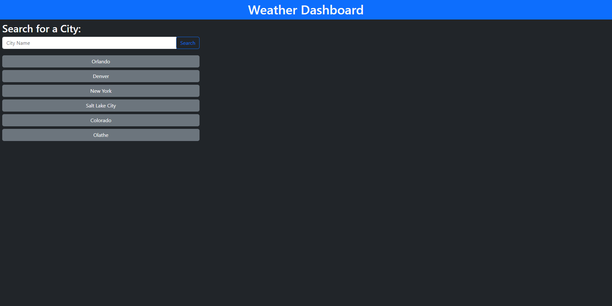
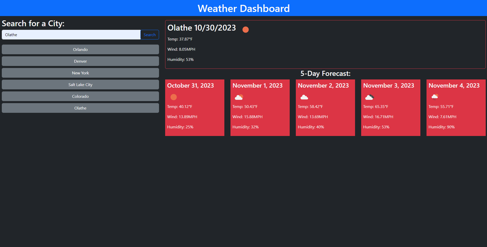

# weather-dashboard

## Description

This project was started with the intent of learning how to use APIs and also make their data usable. You can search any city that the API has in its large database and it will give you the current weather as well as a 5 day forecast that includes the temperature, wind speed, humidity, and the weather type. I had to use their geocoding api to retrieve the coordinates after the user types in the name of the city. Both the current weather API and the forecast API depend on the geocoding api to give the coordinates in latitude and longitude instead of the city name so they can actually give you usable data.

## Example of Weather Dashboard

[Deployed Application Here](https://collinshepherd.github.io/weather-dashboard/)

## Usage

To use the application you start by typing in a city into the search box and either press enter or click the search button. After you search the api will retrieve the data and then display it on the page in around 1 second. Your recent searches will also show below the search box as clickable buttons that will redirect you back to the data that was displayed for those cities. They are saved in local storage so that on page reload they will stay there. There can only be a max of 8 boxes so after there are 8 it will remove the oldest item in the array and the new one will be added to the array.

## Credits

I used the [DayJs](https://day.js.org/docs/en/installation/installation) api to get the current date as well as altering the format of the date to be used for if statement checks. I also used the [openweathermap](https://openweathermap.org/) api for all the data shown on the page. I used 3 of their apis, 5 day 3 hour forecast, current weather api, and the geocoding api.

## License

Please refer to the LICENSE in the repo
